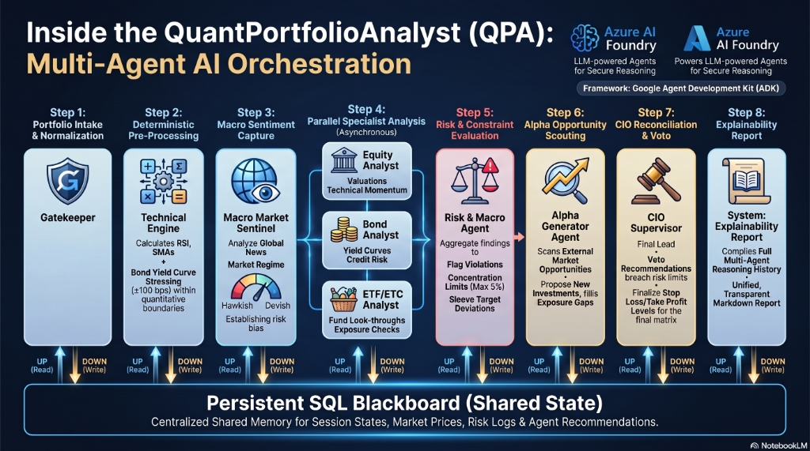
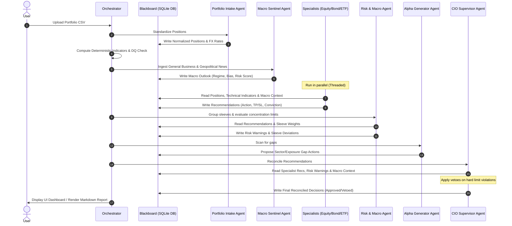

# QuantPortfolioAnalyst (QPA)
### Multi-Agent Quantamental Portfolio Analyst Platform

QuantPortfolioAnalyst (QPA) is a state-of-the-art multi-agent financial analysis platform designed to ingest, analyze, and optimize multi-asset portfolios. Operating under a **Pension Fund sleeve allocation model**, the platform uses specialized AI agents to evaluate equities, bonds, ETFs, and ETCs, calculate technical risk boundaries (Stop Loss & Take Profit), and provide quantitative and macro-rebalancing recommendations.

---

## 1. Project Overview
QPA acts as an automated Chief Investment Officer (CIO) suite. It takes a raw, heterogeneous portfolio snapshot (with cross-listed assets, multiple currencies, and mixed asset classes), cleans it, performs deep analytics, and executes a multi-agent validation workflow.

### Core Strengths:
* **Google Agent Development Kit (ADK) Architecture**: Multi-agent framework built with distinct roles, goals, system prompts, and task-specific logic.
* **Blackboard State Machine**: A central SQLite database acts as a shared state Blackboard where agents write their findings, log audits, and fetch upstream data.
* **Pension Fund Allocation Split**: Implements a target sleeve split model (defaulting to **60/40**):
  * **Aggressive Sleeve (60% weight, target 15% ROI)**: Equities, commodity ETCs, growth ETFs, and high-yield sovereign debt.
  * **Conservative Sleeve (40% weight, target 5% ROI)**: Investment-grade sovereign debt and fixed-income/money-market ETFs.
- **Live Technical Indicators**: Computes SMA-50, SMA-200, 14-day Wilder's RSI, and 60-day Support/Resistance using local Pandas calculations populated by a bulk yfinance download.
- **Fixed-Income Stress Testing**: Calculates clean bond support/resistance prices analytically by stressing sovereign yield curves (from FRED) by $\pm 100\text{ bps}$.

---

## 2. Agentic Blackboard Architecture & Interaction Flow

QPA implements a **Blackboard Architectural Pattern**. Instead of agents communicating directly with one another or writing raw SQL queries, they communicate asynchronously by writing to and reading from a central shared state—the **SQLite Blackboard Database**. 

### How Agents Interact with the SQLite Blackboard
To maintain a strict separation of concerns and database-agnostic agent reasoning:
1. **The Translation Layer**: LLM agents are not aware of the physical database schema, tables, or DDLs. Instead, a Python **Repository translation layer** (`Repository`) executes the SQL queries, retrieves database records, and packages them into clean, minified JSON contexts injected into the agents' prompts.
2. **Reasoning & Structured Output**: The agent processes the context and returns structured JSON (validated via Pydantic).
3. **Persistence**: The orchestrator receives the agent's JSON output, parses/validates it, and writes the structured records back into the SQLite Blackboard relational tables using repository methods.

The following sequence diagram illustrates how data flows chronologically through the orchestrator, the agents, and the central Blackboard database:

### Agent Roles & Goals:

1. **Portfolio Intake & Ingestion Agent (The Gatekeeper)**
   * **Goal**: Normalize heterogeneous inputs (ISINs, Tickers, exchanges) and apply FX translations to a single base currency (EUR) using spot rates.
   * **Write Destination**: Standardized positions table.

2. **Macro Market Sentinel Agent**
   * **Goal**: Analyze global macro news and geopolitical stress.
   * **Write Destination**: Macro outlook table. Sets the portfolio bias overlay (e.g. Conservative vs Aggressive) and market regime (e.g. Hawkish rates) that cascade down to all specialist agents.

3. **Equity Analyst Agent**
   * **Goal**: Evaluate stock valuations and momentum trends.
   * **Input**: Position data, local indicators, macro context, and qualitative news sentiment score.
   * **Context Hurdle**: Evaluates returns against the **15% Aggressive sleeve target ROI**.
   * **Write Destination**: Technical levels (Stop Loss & Take Profit) and purchase/sale actions.

4. **Bond Analyst Agent**
   * **Goal**: Analyze coupon yields, modified duration, convexity, and sovereign yield spreads.
   * **Input**: Position data, analytical yield curves (stressed $\pm 100\text{ bps}$), and macro context.
   * **Context Hurdle**: Maps high-yield bonds to the Aggressive sleeve (15% target ROI) and investment-grade sovereign debt to the Conservative sleeve (5% target ROI).
   * **Write Destination**: Bond recommendations and Stop Loss & Take Profit boundaries.

5. **ETF/ETC Analyst Agent**
   * **Goal**: Execute fund look-through and constituents analysis.
   * **Input**: ETF positions, local technical indicators, macro context, and holdings overlap.
   * **Context Hurdle**: Maps commodity/growth products to the Aggressive sleeve (15% target ROI) and treasury/money-market swaps to the Conservative sleeve (5% target ROI).
   * **Write Destination**: Fund recommendations and Stop Loss & Take Profit limits.

6. **Risk & Macro Agent**
   * **Goal**: Verify single-asset limits (max 5% exposure), sector limits (max 30%), unhedged USD limits (max 35%), and check deviation from target split (60/40 default).
   * **Write Destination**: Risk warnings log.

7. **Alpha Generator Agent**
   * **Goal**: Scan external market opportunities to propose allocations addressing identified gaps.
   * **Write Destination**: Proposed alpha opportunities.

8. **CIO Supervisor Agent (The Coordinator)**
   * **Goal**: Reconcile analyst recommendations against active risk warnings. Vetoes any recommendations that violate hard concentration limits, overrides targets, and finalizes resolved Stop Loss / Take Profit levels.
   * **Write Destination**: Reconciled final recommendations table.

---

## 3. System Execution Sequence

The platform orchestrates the agents sequentially using the **SQLite Blackboard Database** as a central message hub (as shown in the interaction diagram in Section 2). This sequence allows downstream agents to react dynamically to changes in global parameters and technical risk indicators:

1. **Initialization & DB Schema verification**: Ensures structural tables exist.
2. **Ingestion & FX Normalization**: Normalizes headers, ISINs, and translates original currencies to base EUR.
3. **Deterministic Pre-Processing**: Downloads pricing feeds and FRED sovereign yield curves, stressing the rates by $\pm 100\text{ bps}$ to calculate present value boundaries for bonds.
4. **Data Quality Gate**: Checks completeness of indicators and prices.
5. **Macro Sentiment Capture**: Macro Sentinel Agent reviews market regime and posts global risk scores to the blackboard.
6. **Parallel Specialist Analysis**: Equity, Bond, and ETF specialist agents read indicators and macro contexts, producing Stop Loss, Take Profit, and gross delta buy/sell actions.
7. **Risk Constraints Evaluation**: Risk & Macro Agent aggregates actual portfolio weights and flags sleeve exposure deviations.
8. **Alpha Opportunity Scouting**: Alpha Generator scans gaps in allocations and proposes addition targets.
9. **CIO Reconciliation & Vetoing**: CIO Supervisor reconciles specialist recommendations, applies constraints overrides, vetoes hard limit breaches, and generates a final decisions matrix.
10. **Explainability Report Generation**: Renders the complete analysis history into a unified markdown summary.

---

## 4. Semantic Configurations Map

The public repository contains the declarative schemas, prompts, and behavioral definitions under the `.agents/` folder. These files outline the semantic contracts of the multi-agent system:

* **`.agents/root.md`**: Declares the system scope, blackboard database configuration, and the roster of active agents.
* **`.agents/sub_agents/`**: Contains markdown configuration files detailing the role, mission, data sources, and strict execution rules for each agent:
  * `portfolio_intake_agent.md`: normalizes portfolio CSV snapshots.
  * `macro_market_sentinel.md`: registers the macro regime and geopolitical stress.
  * `equity_analyst.md`, `bond_analyst.md`, `etf_etc_analyst.md`: specialist analysts that calculate technical entry/exit limits (TP/SL).
  * `risk_macro_agent.md`: monitors single-asset concentration limits (5%) and sleeve splits.
  * `alpha_generator.md`: scans gap opportunities.
  * `cio_supervisor.md`: applies vetoes and overrides to resolve recommendations.
* **`.agents/prompts/`**:
  * `shared_guardrails.md`: strict system constraints applied to all agent operations.
  * `shared_decision_taxonomy.md`: standardized gross actions (e.g. `INCREASE`, `REDUCE`, `HOLD`).
* **`.agents/schemas/`**: Enforces strict structured output schemas (`json`) for recommendations, risk constraints, explanation objects, and data quality logs.

